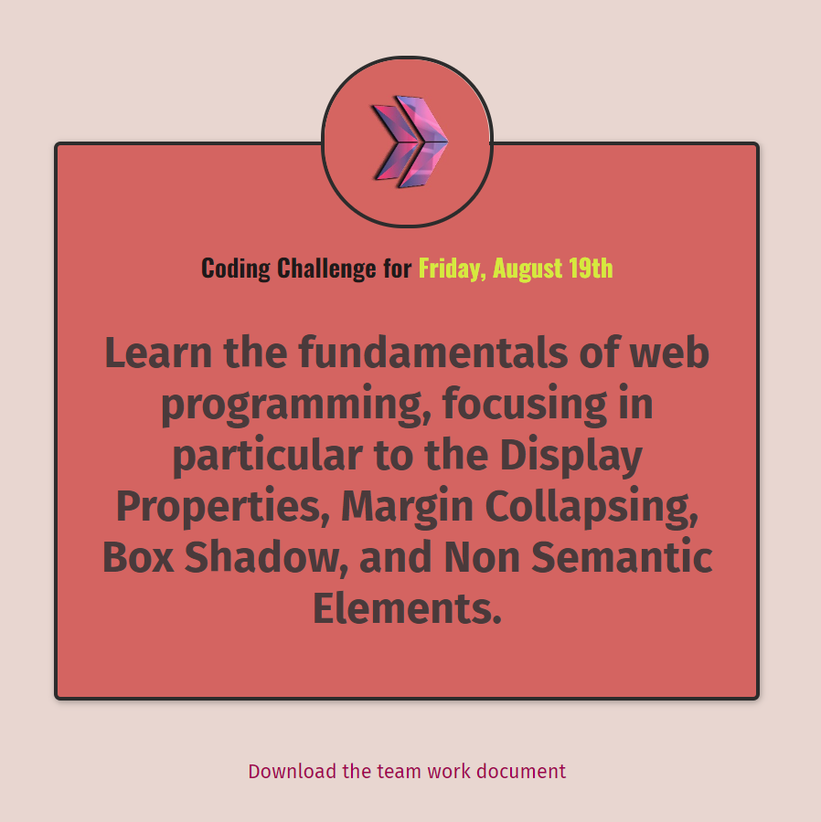

Clarusway

# Coding Challenge - 003 : CSS Margins 

The purpose of this coding challenge is to write code that renders the page in the image.

## Learning Outcomes

At the end of the this coding challenge, students will be able to;

- analyze a problem, identify and apply programming knowledge for appropriate solution.

- demonstrate their knowledge of algorithmic design principles by using function effectively.

   
## Problem Statement

- Write a code that creates a page in the image.

You can find Clarusway Logo in the [images](./images/) folder

 ⌛ Happy Coding  ✍ 
